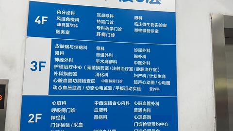
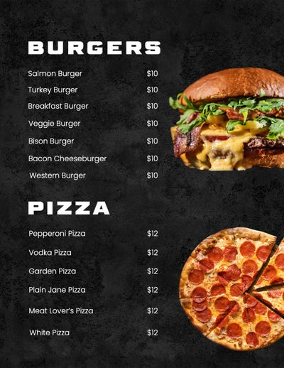
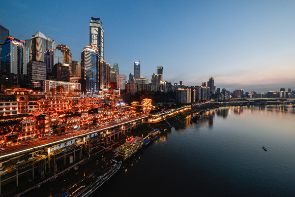
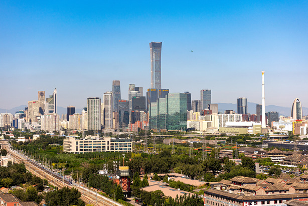
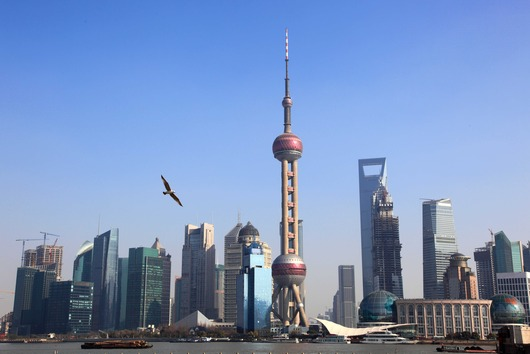
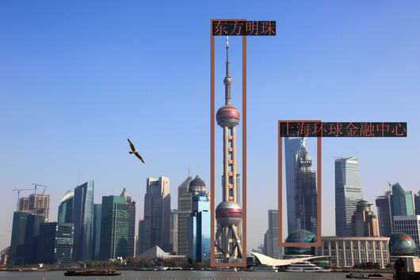

# Qwen-VL-Chat使用教程
Qwen-VL-Chat是通用多模态大规模语言模型，因此它可以完成多种视觉语言任务。在本教程之中，我们会给出一些简明的例子，用以展示Qwen-VL-Chat在**视觉问答，文字理解，图表数学推理，多图理解和Grounding**(根据指令标注图片中指定区域的包围框)等多方面的能力。请注意，展示的例子远非Qwen-VL-Chat能力的极限，**您可以通过更换不同的输入图像和提示词（Prompt），来进一步挖掘Qwen-VL-Chat的能力！**

## 初始化Qwen-VL-Chat模型
在使用Qwen-VL-Chat之前，您首先需要初始化Qwen-VL-Chat的分词器（Tokenizer）和Qwen-VL-Chat的模型：
```python
import torch
from transformers import AutoModelForCausalLM, AutoTokenizer
from transformers.generation import GenerationConfig

# 如果您希望结果可复现，可以设置随机数种子。
# torch.manual_seed(1234)

tokenizer = AutoTokenizer.from_pretrained("Qwen/Qwen-VL-Chat-Chat", trust_remote_code=True)

model = AutoModelForCausalLM.from_pretrained("Qwen/Qwen-VL-Chat-Chat", device_map="cuda", trust_remote_code=True).eval()
model.generation_config = GenerationConfig.from_pretrained("Qwen/Qwen-VL-Chat-Chat", trust_remote_code=True)
```
在执行完上述代码后，```tokenizer```将对应Qwen-VL-Chat使用的分词器，而```model```将对应Qwen-VL-Chat的模型。```tokenizer```用于对图文混排输入进行分词和预处理，而```model```则是Qwen-VL-Chat模型本身。

## 使用Qwen-VL-Chat
### **多轮视觉问答**
#### **第一个问题**
首先我们来看一个最简单的例子，如下图所示，文件```assets/mm_tutorial/Rebecca_(1939_poster).jpeg```是1940年电影Rebecca的于1939发布的海报。

_Small.jpeg)

我们来问一问Qwen-VL-Chat海报上电影的名称是什么。首先，我们使用tokenizer.from_list_format可以对图文混排输入进行分词与处理：
```python
query = tokenizer.from_list_format([
    {'image': 'assets/mm_tutorial/Rebecca_(1939_poster).jpeg'},
    {'text': 'What is the name of the movie in the poster?'},
])
```
接下来，我们可以使用```model.chat```向Qwen-VL-Chat模型提问并获得回复。注意在第一次提问时，对话历史为空，因此我们使用```history=None```。
```python
response, history = model.chat(tokenizer, query=query, history=None)
print(response)
```
您应该会得到类似下列的输出结果：

> The name of the movie in the poster is "Rebecca."

这说明模型正确的回答了问题！根据海报，该电影的名称的确是**Rebecca**。

#### **多轮问答**
我们还可以继续向模型发问，例如询问电影的导演是谁。在后续提问时，对话历史并不为空，我们使用```history=history```向```model.chat```传递之前的对话历史：
```python
query = tokenizer.from_list_format([
    {'text': 'Who directed this movie?'},
])
response, history = model.chat(tokenizer, query=query, history=history)
print(response)
```

您应该会得到类似下列的输出结果：

> The movie "Rebecca" was directed by Alfred Hitchcock.

模型再次正确回答了问题！根据海报，该电影的导演是Alfred Hitchcock。

### **文字理解**
Qwen-VL-Chat具有一定的针对包含密集文字图片的理解能力。如下图所示，文件```assets/mm_tutorial/Hospital.jpeg```是一个包含密集文字的医院指示牌。



我们可以像之前一样向模型询问医院中各个科室的位置，对话历史为空，因此我们使用```history=None```。
```python
query = tokenizer.from_list_format([
    {'image': 'assets/mm_tutorial/Hospital.jpg'},
    {'text': 'Based on the photo, which floor is the Department of Otorhinolaryngology on?'},
])
response, history = model.chat(tokenizer, query=query, history=None)
print(response)
```

您应该会得到类似下列的输出结果：

> The Department of Otorhinolaryngology is located on the 4th floor.

您同样可以进一步提出后续问题，此时需要使用```history=history```向```model.chat```传递之前的对话历史。

```python
query = tokenizer.from_list_format([
    {'text': 'Based on the photo, which floor is the Department of Surgery on?'},
])
response, history = model.chat(tokenizer, query=query, history=history)
print(response)
```

您应该会得到类似下列的输出结果：

> The Department of Surgery is located on the 3rd floor.

### **图表数学推理**
利用模型的图表理解和数学推理能力，Qwen-VL-Chat还可以完成更复杂的一些任务！如下图所示，文件```assets/mm_tutorial/Menu.jpeg```展示了一家餐厅的菜单。现在我们想知道，如果购买两个Salmon Burger和三个Meat Lover's Pizza需要花多少钱呢？



```python
query = tokenizer.from_list_format([
    {'image': 'assets/mm_tutorial/Menu.jpeg'},
    {'text': 'How much would I pay if I want to order two Salmon Burger and three Meat Lover\'s Pizza? Think carefully step by step.'},
])
response, history = model.chat(tokenizer, query=query, history=None)
print(response)
```

```Think carefully step by step.```是一个引导模型分步处理复杂任务的常见提示词，如果您需要完成的任务较为复杂，可以试着使用它来提高准确率。您应该会得到类似下列的输出结果：

> To order two Salmon Burgers and three Meat Lover's Pizzas, you would need to pay the following:
> 
> 1. For two Salmon Burgers: x2 Salmon Burgers at $10 each = $20
> 2. For three Meat Lover's Pizzas: x3 Meat Lover's Pizzas at $12 each = $36
> 
> Therefore, the total cost would be $56.

### **多图理解与中文输入**
在之前的例子中，我们主要展示了Qwen-VL-Chat针对单张图像和英文问题的问答能力。但实际上，Qwen-VL-Chat是支持中文输入的多语言模型，而且也支持多张图片的输入！下面的例子中，我们用中文让Qwen-VL-Chat来为我们比较重庆和北京这两个城市的照片（```assets/mm_tutorial/Chongqing.jpeg```和```assets/mm_tutorial/Beijing.jpeg```）：





```python
query = tokenizer.from_list_format([
    {'image': 'assets/mm_tutorial/Chongqing.jpeg'},
    {'image': 'assets/mm_tutorial/Beijing.jpeg'},
    {'text': '上面两张图片分别是哪两个城市？请对它们进行对比。'},
])
torch.manual_seed(5678)
response, history = model.chat(tokenizer, query=query, history=None)
print(response)
```

您应该会得到类似下列的输出结果：

> 第一张图片是重庆的城市天际线，它反映了现代都市的繁华与喧嚣。第二张图片是北京的天际线，它象征着中国首都的现代化和国际化。两座城市都是中国的重要城市，拥有独特的文化和发展历史。

**请注意，城市间的比较是一个具有相当主观性的问题，因此模型产生的回复可能具有相当高的随机性。若不使用```torch.manual_seed(5678)```设置随机数种子，每次的输出结果会不一样。即使您设置了随机数种子，由于软硬件环境的差异，得到的结果也可能与本文档中的有所不同。**

### **Grounding能力**
在最后，我们展示Qwen-VL-Chat模型产生包围框的能力。Qwen-VL-Chat可以根据您的语言描述，在图像中用矩形框框出指定区域。这样说可能有些抽象，让我们来看下面的例子。如下图所示，文件```assets/mm_tutorial/Shanghai.jpg```是上海的一张照片，我们先用常规的提示词，问一下模型图里有什么。



```python
torch.manual_seed(1234)
query = tokenizer.from_list_format([
    {'image': 'assets/mm_tutorial/Shanghai.jpg'},
    {'text': '图里有啥'},
])
response, history = model.chat(tokenizer, query=query, history=None)
print(response)
```

您应该会得到类似下列的输出结果：

> 图中是中国上海的天际线，包括了上海塔、金茂大厦、上海环球金融中心、海洋大厦等著名建筑。

接下来，我们通过使用```请给我框出图中上海环球金融中心和东方明珠```这个提示词来和模型对话，看看会发生什么。注意此时需要使用```history=history```向```model.chat```传递之前的对话历史。
```python
query = tokenizer.from_list_format([
    {'text': '请给我框出图中上海环球金融中心和东方明珠'},
])
response, history = model.chat(tokenizer, query=query, history=history)
print(response)
```
您应该会得到类似下列的输出结果：
```xml
<ref>上海环球金融中心</ref><box>(667,437),(760,874)</box>和<ref>东方明珠</ref><box>(506,75),(582,946)</box>
```
Qwen-VL-Chat模型没有手，但也没有拒绝您的请求，而是输出了一些“奇怪”的东西——并不是，实际上，模型的输出以标记语言的形式给出了上海环球金融中心和东方明珠在图中的具体位置。您可以使用下列代码将其可视化：
```python
image = tokenizer.draw_bbox_on_latest_picture(response, history)
image.save('Shanghai_Output.jpg')
```
保存下来的```Shanghai_Output.jpg```结果将类似于下面的截图：



在此之后，您还可以继续照常和Qwen-VL-Chat对话：
```python
query = tokenizer.from_list_format([
    {'text': '帮我写个这座城市的旅游计划'},
])
response, history = model.chat(tokenizer, query=query, history=history)
print(response)
```

您应该会得到类似下列的输出结果：

> 好的，以下是一个简单的上海旅游计划：
>
> 第一天：
> 上午：抵达上海，前往酒店办理入住手续。
> 中午：享用午餐后，前往外滩，欣赏黄浦江畔的美景，游览上海地标性建筑如浦发银行大楼、汇丰银行大楼等。
> 下午：游览南京路步行街，购买特色礼品或品尝当地美食。
> 晚上：在南京路附近的餐厅享用晚餐，然后去看上海的夜景。
>
> 第二天：
> 上午：前往上海科技馆，了解科技发展历史，观看各种科技展览。
> 中午：在科技馆附近的餐厅享用午餐。
> 下午：游览世纪公园，欣赏美景并放松身心。
> 晚上：在南京路或附近的陆家嘴地区享用晚餐，然后去看上海的夜景。
>
> 第三天：
> 上午：游览上海迪士尼乐园或上海海昌海洋公园，与各种迪士尼角色互动，或者在海洋公园观看海洋生物表演。
> 中午：在迪士尼乐园或海洋公园附近的餐厅享用午餐。
> 下午：自由活动，可以去购物、品尝当地美食或者去博物馆等。
> 晚上：在酒店附近享用晚餐，然后离开上海。
>
> 当然，以上只是一个简单的计划，上海有许多其他景点和活动，例如参观上海博物馆、游览田子坊、观看上海话剧等。具体计划可以根据个人兴趣和时间进行调整。

**请注意，旅游计划是一个具有相当主观性的问题，因此模型产生的回复可能具有相当高的随机性。若不使用```torch.manual_seed(1234)```设置随机数种子，每次的输出结果会不一样。即使您设置了随机数种子，由于软硬件环境的差异，得到的结果也可能与本文档中的有所不同。**
